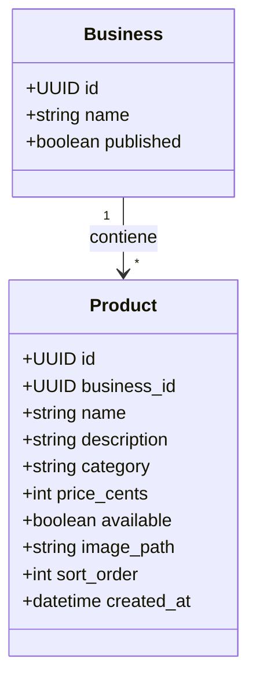

# SDD — 02: Flujos, Categorías y Estados de Producto

> **Módulo:** `02-catalogo-y-carta`  
> **Fase:** 2  

---

## 1. Modelo de Dominio

---

## 2. Reglas de Negocio

1. **Precios en Centavos:** Todos los precios se manejan como números enteros de centavos (`price_cents >= 0`) para evitar errores de precisión de coma flotante.
2. **Aislamiento Multi-Tenant:** Los productos pertenecen estrictamente a un único `business_id`.
3. **Visibilidad Pública Condicionada:** Un producto solo puede ser visto por clientes si el comercio tiene `businesses.published = true`.
