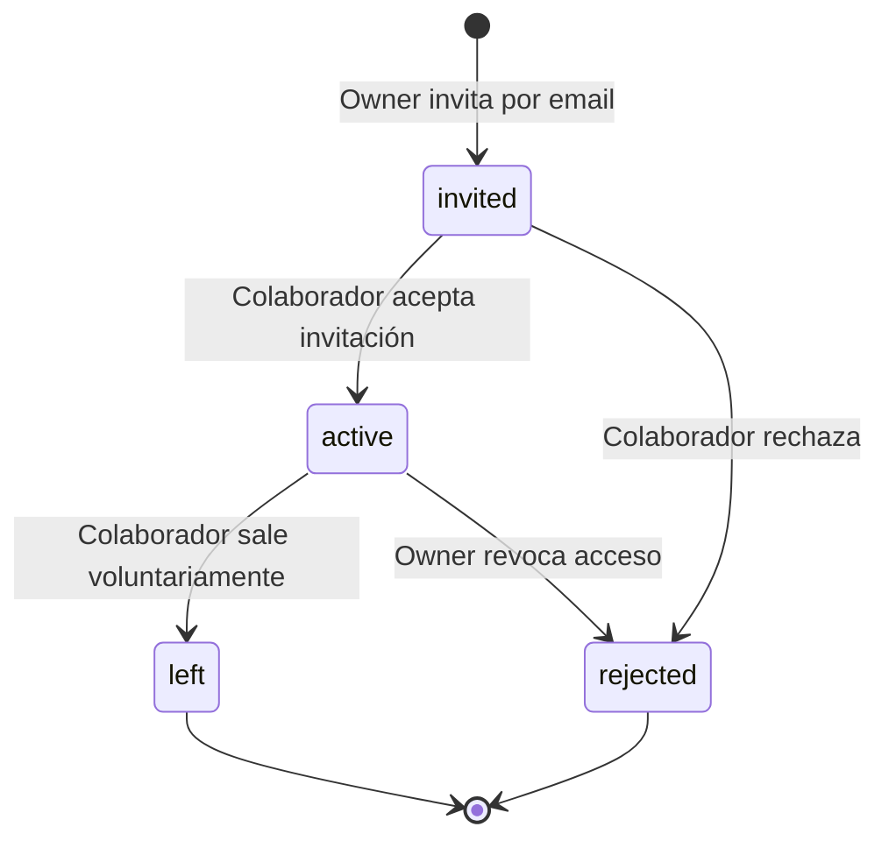

# SDD — 02: Ciclo de Vida y Permisos de Equipo

> **Módulo:** `03-equipo-e-invitaciones`  
> **Fase:** 3  

---

## 1. Ciclo de Vida de una Membresía

---

## 2. Reglas de Negocio

1. **Permiso de Invitación:** Solo los miembros con rol `owner` pueden invitar o modificar miembros.
2. **Protección del Último Owner:** Un negocio nunca puede quedar sin al menos un `owner` con estado `active`.
3. **Privacidad de Métricas:** Los usuarios con rol `staff` o `driver` no tienen acceso a paneles financieros del comercio.
