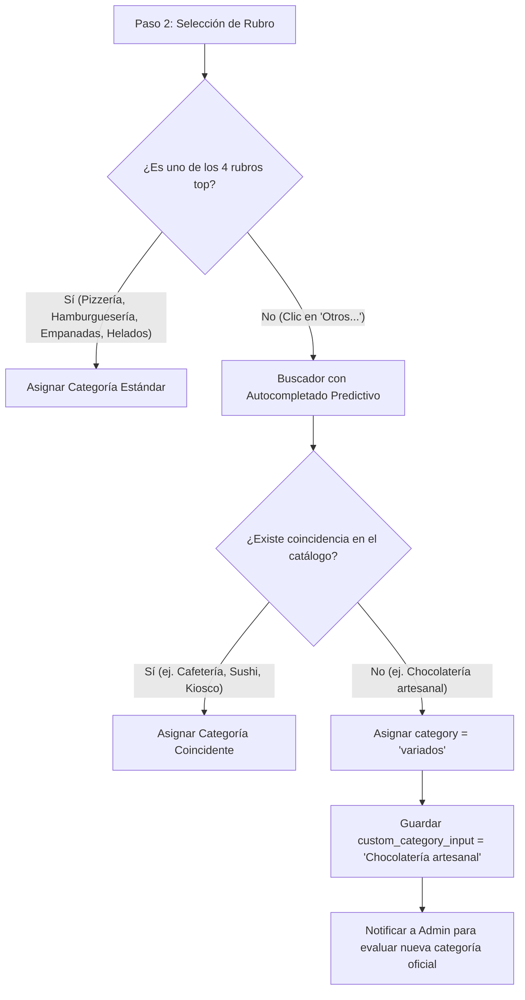

# SDD — 02: Flujos del Wizard, Layout Stepper & Taxonomía

> **Módulo:** `04-leads-admin-y-onboarding`  
> **Fase:** 4  

---

## 1. Arquitectura Visual del Stepper Wizard

Inspirado en la estética de SaaS moderna con **adaptabilidad responsive completa**:

### 1.1 Desktop Layout (Sidebar Izquierda)
```
┌──────────────────────────────┬────────────────────────────────────────────────────────┐
│  ← Volver                    │                                                        │
│                              │   Sobre tu negocio                                     │
│  (✓) 1. Tu cuenta            │                                                        │
│  (●) 2. Tu negocio           │   Nombre del comercio:                                 │
│  ( ) 3. Elegir plan          │   [ Pizzería San Carlos                              ] │
│                              │                                                        │
│                              │   Rubro principal:                                     │
│                              │   [🍕 Pizzería]  [🍔 Hamburguesería]  [🥟 Empanadas]   │
│                              │   [🍦 Heladería] [✨ Otros...]                         │
│                              │                                                        │
│                              │   WhatsApp de pedidos:                                 │
│                              │   [ +54 9 2314 123456                                ] │
│                              │                                                        │
│                              │   Dirección:                                           │
│                              │   [ Av. San Martín 450                               ] │
│                              │                                                        │
│                              │   [ Continuar → ]                                      │
└──────────────────────────────┴────────────────────────────────────────────────────────┘
```

### 1.2 Mobile Layout (Barra de Progreso Superior)
```
┌────────────────────────────────────────────────────────┐
│  ← Volver                                              │
│  (✓) ─── (●) ─── ( )                                  │
│          Tu negocio                                    │
│                                                        │
│  Sobre tu negocio                                      │
│  [ Campos limpios y táctiles con espaciado amplio ]    │
│                                                        │
│  [ Continuar → ]                                       │
└────────────────────────────────────────────────────────┘
```

---

## 2. Taxonomía de Rubros & Fallback Predictivo

Para no abrumar al usuario con un menú desplegable de 50 opciones, implementamos un **sistema en dos niveles de selección**:



### Catálogo de Autocompletado Predictivo
- `cafeteria`, `farmacia`, `kiosco`, `almacen`, `sushi`, `asado`, `pastas`, `panaderia`, `saludable`, `sandwiches`, `rotiseria`, `verduleria`, `carniceria`, `dietetica`, `bebidas`.

---

## 3. Integración de Planes de Monetización (Paso 3)

| Card del Plan | Costo Fijo | Comisión | Destacado / Copy |
|---|:---:|:---:|---|
| **🟢 Plan Inicial (Gratis)** | **$0 / mes** | **7%** | ⭐ **Recomendado para empezar**<br>• Cero costo fijo ni riesgo<br>• Menú digital QR + hasta 15 productos<br>• Notificaciones de pedidos en vivo |
| **🔵 Plan Impulso** | **$45.000 / mes** | **3.5%** | 🤖 **Automatización con IA**<br>• Bot de WhatsApp que atiende audios<br>• Catálogo ilimitado<br>• Tiempos de cocina en 1 toque (15/25/35/45m) |
| **🟣 Plan Líder** | **$95.000 / mes** | **0%** | 👑 **Posicionamiento VIP**<br>• **0% de comisión** (ganancia 100% tuya)<br>• Banners destacados en portada de Bolívar<br>• Cuentas de equipo para cocina y caja |

---

## 4. Estrategia de Cobros: Mercado Pago OAuth

- **Cero carga manual:** Se eliminan campos de CBU, Alias o datos de banco en el onboarding.
- **Conexión en 1 Clic:** Desde la configuración del panel (`/negocio/[businessId]/configuracion`), el dueño simplemente hace clic en **"Conectar mi cuenta de Mercado Pago"**.
- Esto autoriza a la plataforma a procesar pagos de clientes y enrutar las liquidaciones automáticamente con comisiones deducidas según el plan activo.
