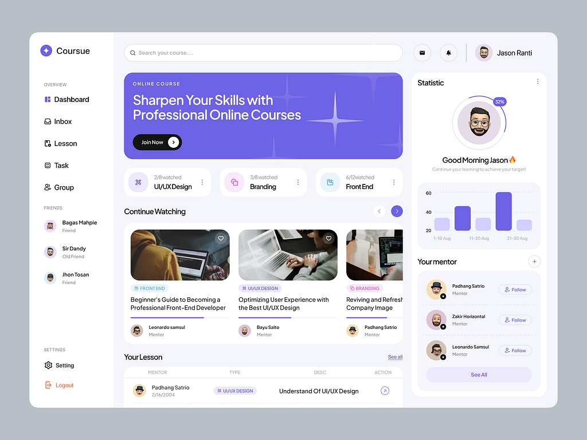

# Panel de Negocio — Spec

> Referencia visual Dashboard: `docs/panel-negocio-ref.png`
> Referencia visual CRUD & Tablas: `Cafe Burito CRUD Reference (docs/especificacion_dashboard_negocios.md)`



## 1. Estructura de rutas

```
src/app/
  (business)/
    layout.tsx              # Sidebar colapsable + Topbar
    page.tsx                # Redirect a /negocio/dashboard
    dashboard/
      page.tsx              # Stats cards + actividad reciente + gráfico
    carta/
      page.tsx              # Tabla de productos mock + header
    equipo/
      page.tsx              # Placeholder "Tu Equipo"
    configuracion/
      page.tsx              # Placeholder "Configuración"
```

Route group `(business)` — no hereda el Navbar del home.

## 2. Layout `(business)/layout.tsx`

### Sidebar (izquierda)

**Desktop (≥768px):**
- **Colapsable**: `240px` abierto / `64px` cerrado. Transición `transition-all duration-300`.
- **Toggle**: botón hamburguesa (`menu` / `menu_open`) en el header del sidebar.
- Colapsado: solo íconos centrados, tooltip en hover con el nombre.

**Mobile (<768px):**
- Sidebar oculto por defecto (`-translate-x-full`).
- Abrir con botón hamburguesa en el topbar → overlay oscuro + drawer deslizante desde la izquierda.
- Cerrar con: tap fuera del drawer, botón cerrar (`close`), o al navegar a una sección.
- `framer-motion` para la animación del drawer (mismo patrón que dropdowns en `Navbar.tsx`).

| Item | Ícono (Material Symbol) | Ruta |
|------|------------------------|------|
| Logo B | *(gradiente cherry cola #9a0002→#6b0001)* | — |
| Dashboard | `dashboard` | `/negocio/dashboard` |
| Carta | `menu_book` | `/negocio/carta` |
| Equipo | `group` | `/negocio/equipo` |
| *spacer* | | |
| Configuración | `settings` | `/negocio/configuracion` |
| Desconectar | `logout` | *vuelve a `/`* |

- Item activo: bg `#9a0002/10`, text `#9a0002`, borde izquierdo `2px solid #9a0002`.
- Desconectar cierra el drawer y redirige a `/`.

### Topbar

```
Mobile:    [☰] — [Logo-negocio] — [🔔²] — [Avatar]
Desktop:   [Logo-negocio] — [Searchbar] — [🌙/☀️] — [🔔³] — [Avatar] — [Nombre del local]
```

- **Hamburguesa (mobile only)**: `MaterialSymbol icon="menu"`, abre el drawer del sidebar.
- **Logo**: círculo `32px` con iniciales del negocio (mock: "MC" sobre gradiente).
- **Searchbar (desktop)**: input con `MaterialSymbol icon="search"`, placeholder "Buscar en el panel...".
- **Search (mobile)**: `MaterialSymbol icon="search"` en ícono, abre un input expandible o modal simple.
- **Theme toggle (desktop)**: reutilizar `startThemeTransitionFrom()` + `SkiperSunMoon` de `Navbar.tsx`.
- **Notificaciones**: `CherryBtn` con **badge numérico** (contador de 3 sin leer mock). Badge: `"absolute -top-1.5 -right-1.5 min-w-[18px] h-[18px] bg-[#ffeb3b] text-[#6b0001] text-[9px] font-black rounded-full flex items-center justify-center px-[4px]"`. Al abrir, el contador se limpia. Dropdown con lista mock (mismo patrón que `Navbar.tsx`: `AnimatePresence` + framer-motion).
- **Avatar + nombre**: círculo con iniciales + nombre del negocio truncado (desktop; mobile: solo avatar).

### Transiciones entre secciones

El `<main>` del layout wrappea `{children}` en `<AnimatePresence mode="wait">` con:
```tsx
<motion.div
  key={pathname}
  initial={{ opacity: 0, y: 8 }}
  animate={{ opacity: 1, y: 0 }}
  exit={{ opacity: 0, y: -8 }}
  transition={{ duration: 0.2 }}
>
  {children}
</motion.div>
```
El `key` se obtiene de `usePathname()` para que Next.js dispare la animación al cambiar de ruta.

## 3. Dashboard (`/negocio/dashboard/page.tsx`)

### Header

- Título "Dashboard" + subtítulo "Resumen de tu negocio".
- Selector de período mock: Hoy / Esta semana / Este mes (tabs chicas).

### Stats Cards (grid responsive: 1 col mobile, 2 cols tablet, 4 cols desktop)

Mismo estilo de card que en `page.tsx`:
```css
bg-[#faf6f1] dark:bg-[#1c1917] border border-gray-100 dark:border-[#3d3732] penpot-shadow rounded-[24px]
```

4 cards mock:

| Card | Ícono | Valor | Label |
|------|-------|-------|-------|
| Pedidos hoy | `shopping_cart` bg-red-50 | 24 | +33% vs ayer |
| Facturado hoy | `payments` bg-emerald-50 | $187.500 | +32% vs ayer |
| Pedidos activos | `pending_actions` bg-amber-50 | 4 | — |
| Ticket promedio | `receipt` bg-blue-50 | $7.812 | -2% vs ayer |

Cada card:
- Ícono en círculo `40px` con bg suave
- Label en `text-[10px] font-bold uppercase tracking-wider text-gray-400`
- Valor en `font-black text-2xl text-gray-800 dark:text-gray-100`
- Delta en `text-xs` con `MaterialSymbol icon="trending_up"` verde o `trending_down` rojo

### Actividad Reciente

Tabla de últimos 5 pedidos mock:
- Columnas: #Pedido, Cliente, Items, Total, Estado, Hora
- Estados con badge de color:
  - `pending` → `schedule` amarillo
  - `accepted` → `check_circle` verde
  - `cancelled` → `cancel` rojo
  - `delivered` → `task_alt` azul

### Estadísticas (con avatar del dueño)

- Gráfico de barras SVG plano con datos de lunes a domingo.
- Esquina superior derecha: círculo `40px` con iniciales del usuario logueado (mock "SA" de St. Abigail).
- Tooltip en hover sobre cada barra con el valor.

## 4. Carta (`/negocio/carta/page.tsx`)

Mock product table — no un placeholder. Muestra el propósito real de la sección.

### Header

- Título "Mi Carta" + subtítulo "Gestioná tus productos y categorías".
- Botón "Agregar producto" (solo visual, no funcional) con mismo estilo que `CherryBtn`.

### Tabla de productos

Estilo: misma card wrapper que el dashboard (`bg-[#faf6f1]`, `rounded-[24px]`, `penpot-shadow`).
Columnas: Producto, Categoría, Precio, Disponible, (acciones).

6 productos mock:

| # | Producto | Categoría | Precio | Disp? |
|---|----------|-----------|--------|-------|
| 1 | Café con leche | Bebidas calientes | $2.800 | ✅ |
| 2 | Medialuna de manteca | Panadería | $1.200 | ✅ |
| 3 | Tostado de jamón y queso | Sándwiches | $4.500 | ❌ |
| 4 | Cappuccino italiano | Bebidas calientes | $3.200 | ✅ |
| 5 | Torta Oreo | Pastelería | $5.800 | ✅ |
| 6 | Licuado de banana | Bebidas frías | $3.500 | ❌ |

- **Available toggle**: `Switch` visual (un div con transición `bg-[#9a0002]` / `bg-gray-300`), solo apariencia, no funcional.
- **Disponible ✅**: fila normal. **Agotado ❌**: fila con opacidad `opacity-50`.
- **Acciones**: botones ícono `edit` y `delete` inline, solo visuales.
- Cada fila: `border-b border-[#ddd4c8] dark:border-[#3d3732]/60`, última sin borde.

## 5. Equipo, Configuración (placeholders)

Mismo patrón que `case "discover"` y `case "cart"` en `page.tsx`:

- Ícono grande en círculo suave con bg
- Título en `font-extrabold text-base`
- Subtítulo explicativo en `text-xs text-gray-500`
- Botón "Volver al Dashboard"

## 6. Mock Data (extender `src/lib/mockData.ts`)

```ts
export interface PanelProduct {
  id: string; name: string; category: string;
  price: number; available: boolean;
}

export interface BusinessStats {
  ordersToday: number; ordersYesterday: number;
  revenueToday: number; revenueYesterday: number;
  activeOrders: number; avgTicket: number;
}

export interface RecentOrder {
  id: string; orderNumber: number; customerName: string;
  itemsCount: number; total: number;
  status: "pending" | "accepted" | "cancelled" | "delivered"; time: string;
}

export interface BusinessInfo {
  name: string; initials: string; logoBg: string;
}

export const MOCK_PRODUCTS: PanelProduct[];
export const MOCK_BUSINESS: BusinessInfo;
export const MOCK_BUSINESS_STATS: BusinessStats;
export const MOCK_RECENT_ORDERS: RecentOrder[];
export const MOCK_WEEKLY_SALES: number[];  // [lun, mar, mie, jue, vie, sab, dom]
export const MOCK_DAYS: string[];
```

## 7. Botón en "Mi Perfil"

En `page.tsx` `case "profile"`:

- **Si** el dueño tiene negocio (hardcode `isBusinessOwner: true` en el estado): mostrar botón `"🏪 Ir a mi negocio"` que linkea a `/negocio/dashboard`.
- El botón existente `"🏪 Abrir mi negocio"` → `/negocio/registro` se queda para el caso `isBusinessOwner: false`.

## 8. Componentes nuevos

| Componente | Archivo |
|-----------|---------|
| `BusinessLayout` | `src/components/business/BusinessLayout.tsx` |
| `BusinessSidebar` | `src/components/business/BusinessSidebar.tsx` |
| `BusinessTopbar` | `src/components/business/BusinessTopbar.tsx` |
| `StatCard` | `src/components/business/StatCard.tsx` |
| `SimpleBarChart` | `src/components/business/SimpleBarChart.tsx` |

## 9. Convenciones a seguir

- Tailwind v4 (no CSS modules, no styled-components)
- `cn()` de `@/lib/utils` para clases condicionales
- `MaterialSymbol` de `@/components/ui/material-symbol` para íconos
- Dark mode con `dark:` prefix y CSS vars existentes
- framer-motion para animaciones de entrada/transiciones
- Mismo sistema de bordes, sombras y radios que el home (`penpot-shadow`, `rounded-[24px]`, etc.)
