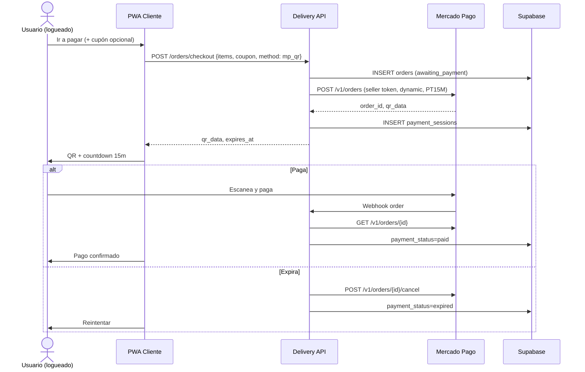

# Spec — Pagos Mercado Pago (QR dinámico + efectivo)

**Fecha:** 2026-08-29  
**Estado:** Implementado (onboarding MP + panel negocio). Pendiente: checkout cliente QR.  
**Referencia técnica:** integración probada en [Cocktrail](/home/cipher/Projects/Cocktrail) (`001-mp-vinculacion-qr-dinamico.md`, módulo `mercadopago-*`)  
**Alcance explícito:** pagos y vinculación MP. **Fuera de scope:** flujo de delivery/logística, fee de plataforma, envío en el monto del QR, multi-sucursal.

---

## 1. Objetivo y restricciones

### Por qué QR dinámico (Orders API)

- Producto MP: **Código QR presencial** (`in_person_payments`, `type: qr`, `mode: dynamic`).
- Comisiones **más bajas** que Checkout Pro / Marketplace online — este es el limitante principal.
- **No usar Checkout Pro** en MVP ni como fallback planificado por comisión.
- **No depender de terminales físicas** (Point / Posnet). Comercios sin terminal deben poder cobrar igual.

### Qué NO queremos

- Pool masivo de cajas/POS artificiales para simular concurrencia.
- Deep links no documentados para abrir MP con QR embebido.
- Cobrar en cuenta propia y repartir por CBU.
- Checkout Pro por comisiones altas.
- Split nativo de marketplace en QR (fee plataforma queda pendiente).

### Modelo operativo (1 comercio adherido)

```
Delivery (integrador)
  └── Comercio adherido (OAuth → access_token del seller)
        └── 1 Store (ubicación real del comercio)
              └── 1 POS / caja (operating_mode: pdv)
                    └── N orders QR dinámicas concurrentes (sin límite por “caja ocupada”)
```

**Concurrencia:** la “cola” vive en backend/DB. MP permite múltiples orders `dynamic` sobre el **mismo** `external_pos_id` en modo `pdv`.

**Multi-local:** diferido. MVP = **1 store + 1 POS por comercio**.

---

## 2. Decisiones de producto (cerradas)

| Tema | Decisión |
|------|----------|
| Canal de pago online | QR dinámico vía Orders API (sin Checkout Pro) |
| Terminal física MP | Opcional / irrelevante para este flujo |
| Orden del flujo | **Pagar primero** → pedido queda esperando aceptación del comercio |
| Expiración QR | **PT15M** (15 minutos), alineado con Cocktrail |
| Monto del QR | **Subtotal de productos** tras cupones. **Envío: fuera de scope** por ahora |
| Cupones | Se validan y aplican **antes** de crear la order MP |
| UI cupones | Botón “¿Tenés un cupón?” al ir a pagar (antes de confirmar método) |
| Auth usuario | **Login obligatorio** — sin usuario no hay pedido |
| Efectivo | Permitido con **aviso de riesgo** (comercio puede rechazar por seguridad) |
| Carrito multi-comercio | **Prohibido en checkout** — un pedido = un comercio |
| Fee plataforma | Pendiente — no bloquea MVP |
| Flujo delivery post-pago | **No documentado aún** — spec solo cubre pago + estados mínimos |

### Pagar primero — por qué encaja

- El dinero va **directo al seller** (sin escrow). Si el comercio rechaza después, hay que **reembolsar** vía API MP.
- Evita pedidos “fantasma” aceptados que nunca se pagan.
- Compatible con QR de 15 min: el cliente no compite con aceptación del local para pagar.
- Rechazo post-pago → `refunded` + notificación al usuario (detalle de fulfillment fuera de este spec).

### Efectivo — copy mínimo sugerido

> “Pagás al recibir el pedido. El comercio puede rechazar pedidos en efectivo por motivos de seguridad o disponibilidad.”

Mostrar **antes** de confirmar el pedido en efectivo (checkbox o modal de confirmación).

---

## 3. Jerarquía MP por comercio

| Entidad MP | Cantidad MVP | Token |
|------------|--------------|-------|
| OAuth seller | 1 por comercio | Del comercio adherido |
| Store | 1 | Seller |
| POS (`pdv`) | 1 | Seller |
| Order QR dynamic | 1 por intento de cobro | Seller |

Al vincular OAuth exitoso, el backend (con token del comercio):

1. Crea **store** (nombre + ubicación real del comercio).
2. Crea **1 POS** (`external_id` único, `config.qr.operating_mode: pdv`).
3. Persiste IDs en DB + tokens cifrados (refresh incluido).

Renovación: refresh automático de access token (~180 días OAuth; refresh proactivo días antes del vencimiento — patrón Cocktrail).

---

## 4. Diseño de datos

### 4.1 Tablas nuevas

#### `mp_merchant_connections`

Vinculación OAuth por comercio (≈ `mercadopago_sellers` de Cocktrail).

| Campo | Notas |
|-------|-------|
| `business_id` | FK UNIQUE → `businesses` |
| `mp_user_id` | ID seller MP |
| `access_token_enc`, `refresh_token_enc` | Cifrado server-side; nunca al cliente |
| `expires_at` | Del token OAuth |
| `nickname`, `email`, `display_name` | Post `GET /users/me` |
| `status` | `active` \| `expired` \| `revoked` |

RLS: solo `service_role`.

#### `mp_stores`

| Campo | Notas |
|-------|-------|
| `business_id` | FK |
| `mp_store_id` | ID MP |
| `external_store_id` | Único por comercio, ej. `DELIVERY-{slug}` |
| `name`, `location` jsonb | **Datos reales** (MP puede mostrar en mapa) |
| `mp_connection_id` | FK — detectar huérfanos al cambiar cuenta |

#### `mp_pos`

| Campo | Notas |
|-------|-------|
| `business_id` | FK UNIQUE en MVP |
| `store_id` | FK → `mp_stores` |
| `mp_pos_id`, `external_pos_id` | Obligatorio `external_pos_id` para orders |
| `operating_mode` | `pdv` |
| `mp_connection_id` | FK |

No tabla `mp_pos_devices` en MVP (Point fuera de scope).

#### `payment_sessions`

Cada intento de cobro QR (≈ `mp_orders` Cocktrail).

| Campo | Notas |
|-------|-------|
| `order_id` | FK → `orders` |
| `business_id` | Denormalizado |
| `channel` | `qr_dynamic` (reservar enum para futuro) |
| `mp_order_id` | `ORD...` |
| `external_reference` | Referencia estable del pedido |
| `idempotency_key` | UNIQUE — dedupe create |
| `payment_transaction_id` | Al crear (≠ payment_id final) |
| `payment_id` | Al `processed` |
| `amount_cents` | Subtotal post-cupón |
| `qr_data` | EMVCo de `type_response.qr_data` |
| `status` | `created` \| `processed` \| `expired` \| `canceled` \| `failed` |
| `expires_at` | created_at + 15 min |

Regla: **máximo 1 sesión activa** (`created` y no vencida) por pedido.

#### `mp_webhook_events`

Persistir webhook antes del 200; dedupe `x-request-id`; replay en boot (Cocktrail).

#### `oauth_states`

`state`, `code_verifier`, `business_id`, `redirect_url`, TTL ~10 min.

### 4.2 Cambios en `orders`

Separar **pago** de **fulfillment** (detalle fulfillment fuera de este spec):

| Campo | Valores / notas |
|-------|-----------------|
| `payment_method` | `mercadopago_qr` \| `cash` |
| `payment_status` | `awaiting_payment` \| `paid` \| `expired` \| `failed` \| `refunded` |
| `active_payment_session_id` | FK nullable |
| `coupon_id` | FK nullable — cupón ya aplicado al monto |
| `subtotal_cents` | Productos post-cupón (base del QR) |
| `mp_payment_id` | Denormalizado al concretar |

**Creación del pedido:** al confirmar checkout (usuario logueado), no mientras el carrito vive solo en cliente.

Estados de pago:

| Estado | Descripción |
|--------|-------------|
| `awaiting_payment` | Order MP creada (QR) o pedido efectivo pendiente de confirmación |
| `paid` | Webhook/poll confirmó pago MP, o efectivo confirmado por flujo acordado |
| `expired` | QR venció sin pago; sesión cancelada en MP |
| `failed` | Error irrecuperable en cobro |
| `refunded` | Devolución procesada vía MP |

---

## 5. Flujos

### Callback OAuth (Edge Function Supabase)

`MP_REDIRECT_URI` apunta a:

`https://<project>.supabase.co/functions/v1/mp-auth-callback`

La función vive en `supabase/functions/mp-auth-callback/` — cifra tokens con `bolivarpide/mp-token/v1`, persiste en `mp_merchant_connections` y redirige a `/negocio/{id}/pagos?linked=true&provision=1`. El provisioning store+POS lo dispara el panel vía `/api/payments/mp/reprovision`.

Secrets en Supabase: `MP_APP_ID`, `MP_CLIENT_SECRET`, `MP_REDIRECT_URI`, `MP_TOKEN_SECRET`, `NEXT_PUBLIC_SITE_URL`.

### 5.1 Onboarding comercio

1. Comercio registrado en panel negocio.
2. “Conectar con Mercado Pago” → OAuth PKCE.
3. Callback: exchange token, cifrar, upsert `mp_merchant_connections`.
4. Crear store + POS con token del comercio.
5. `businesses` habilitado para recibir pagos QR cuando `mp_ready = true`.

Desvincular: tokens `expired`; cajas pueden quedar huérfanas → reprovision al re-vincular (patrón Cocktrail F2).

### 5.2 Checkout usuario — Mercado Pago QR

**Precondiciones:** usuario autenticado; carrito de **un solo** `business_id`; comercio con `mp_ready`.

1. Usuario revisa carrito → “Ir a pagar”.
2. **Cupón (opcional):** botón “¿Tenés un cupón?” → validar → recalcular subtotal.
3. Elegir método: **Mercado Pago (QR)** o **Efectivo** (con aviso).
4. Si QR:
   - Backend crea `orders` (`payment_status = awaiting_payment`, `subtotal_cents` post-cupón).
   - `POST /v1/orders` con token OAuth del **comercio**:
     - `type: qr`, `mode: dynamic`
     - `external_pos_id` del POS del comercio
     - `expiration_time: PT15M`
     - `external_reference` = id pedido
     - `total_amount` = subtotal post-cupón
     - `items[]` snapshot productos
   - Guardar `payment_sessions` con `qr_data`.
5. Frontend: QR + countdown 15 min + “Escaneá con Mercado Pago u otra billetera”.
6. Opcional: botón “Abrir Mercado Pago” como atajo (`https://www.mercadopago.com.ar/` o deep link genérico) **sin** asumir precarga del pago.
7. Pago OK → webhook → `GET /v1/orders/{id}` → `payment_status = paid`.
8. Expira → `POST /v1/orders/{id}/cancel` → `expired` → “Reintentar pago”.

### 5.3 Checkout usuario — Efectivo

1. Mismo carrito + cupón + login.
2. Usuario elige efectivo → modal/aviso de riesgo → confirma.
3. Crear `orders` con `payment_method = cash`, `payment_status` según regla acordada al implementar fulfillment (ej. `awaiting_payment` hasta aceptación o `paid` pendiente — **definir al integrar con flujo de pedidos**).
4. Sin llamadas a MP.

### 5.4 Rechazo comercio post-pago (QR)

1. Comercio rechaza pedido ya `paid`.
2. Backend: `POST /v1/payments/{id}/refunds` con token del comercio.
3. `payment_status = refunded`; notificar usuario.

---

## 6. Diagrama de secuencia — pago QR



---

## 7. Endpoints Mercado Pago

| Método | Ruta | Cuándo | Token |
|--------|------|--------|-------|
| GET | `auth.mercadopago.com/authorization` | Inicio OAuth | — |
| POST | `/oauth/token` | Exchange / refresh | App |
| GET | `/users/me` | Post-OAuth | Seller |
| POST | `/users/{user_id}/stores` | Onboarding | Seller |
| POST | `/v2/pos` | Onboarding POS pdv | Seller |
| POST | `/v1/orders` | Crear QR dynamic | Seller |
| GET | `/v1/orders/{id}` | Poll / webhook reconcile | Seller |
| POST | `/v1/orders/{id}/cancel` | Expiración / cancel | Seller |
| GET | `/v1/payments/{id}` | Neto/fees (fase stats) / refund prep | Seller |
| POST | `/v1/payments/{id}/refunds` | Rechazo post-pago | Seller |

Webhook integrador: topic **`order`**, validar firma `x-signature`, dedupe `x-request-id`.

---

## 8. API propia (contrato)

| Método | Ruta | Descripción |
|--------|------|-------------|
| POST | `/api/payments/mp/oauth/url` | URL OAuth + state |
| GET | `/api/payments/mp/status` | Estado vinculación por `businessId` |
| DELETE | `/api/payments/mp/disconnect` | Desvincular |
| POST | `/api/payments/mp/reprovision` | POS huérfano |
| POST | `/api/coupons/validate` | Validar cupón pre-checkout |
| POST | `/api/orders/checkout` | Crear pedido + QR o efectivo |
| POST | `/api/orders/{id}/payment/retry` | Nueva sesión QR |
| GET | `/api/orders/{id}/payment/status` | Poll |
| POST | `/api/webhooks/mercadopago` | Webhooks MP |

**Cron:** expirar sesiones QR vencidas (backup del countdown cliente).

---

## 9. Casos borde

| Caso | Mitigación |
|------|------------|
| Webhook duplicado | Dedupe `x-request-id` en `mp_webhook_events` |
| Pago simultáneo a expiración | Reconcile MP gana; si `processed`, marcar `paid` |
| Doble click “Pagar” | `X-Idempotency-Key` + UNIQUE en `payment_sessions.idempotency_key` |
| Refresh token inválido | Bloquear checkout; panel “Reconectá MP” |
| Comercio cambia cuenta MP | Reprovision POS; flag huérfano |
| Carrito multi-comercio | 400 en checkout — un comercio por pedido |
| Cupón inválido / expirado | Error antes de crear order MP |
| Efectivo rechazado por comercio | Sin refund MP; flujo fulfillment (TBD) |
| Sin terminal Point | **No aplica** — flujo QR no la requiere |

---

## 10. Reutilización desde Cocktrail

| Componente | Adaptación |
|------------|------------|
| OAuth PKCE + `oauth_states` | + `business_id` |
| Cifrado tokens | Igual (`MP_TOKEN_SECRET`) |
| `createQrOrder` dynamic | PT15M; monto = subtotal post-cupón |
| Webhooks + reconcile | Igual |
| Provisioning store/POS | 1 por `businesses`; dirección real |
| Credentials resolver | Por `business_id`, no seller global |

**No portar:** Point/Posnet, checkout `static`, handoff legacy, single-seller global.

---

## 11. MVP — alcance mínimo

### Incluye

- OAuth adherido + 1 store + 1 POS por comercio
- Order QR dynamic PT15M + webhook + cancel on timeout
- Cupón pre-checkout (botón en pantalla de pago)
- Login obligatorio
- Efectivo con aviso
- Un comercio por checkout
- Pagar primero (QR)

### Excluye

- Checkout Pro
- Terminales Point como requisito
- Envío en monto QR
- Fee plataforma automático
- Multi-sucursal
- Flujo delivery post-pago (aceptación, reparto, etc.)
- Carrito multi-comercio

---

## 12. Pendientes (no bloquean spec)

1. App MP del integrador (¿nueva app vs Cocktrail/MiBoliche?) — definir antes de prod.
2. Validación comercial MP: QR presencial en delivery 100% remoto.
3. Monto y cobro del **envío** (fuera del QR por ahora).
4. Fee plataforma sin split QR.
5. Estado exacto de pedido **efectivo** al crear (depende flujo fulfillment).
6. Fase 2: fallback de canal si MP lo habilita comercialmente sin Checkout Pro.

---

## 13. Referencias

- Cocktrail: `docs/specs/mercadopago/001-mp-vinculacion-qr-dinamico.md`
- MP: Orders QR dynamic, OAuth terceros, Store/POS `pdv`
- Delivery legacy: `ARQUITECTURA.md` § Integraciones (actualizado — ya no Checkout Pro escrow)
