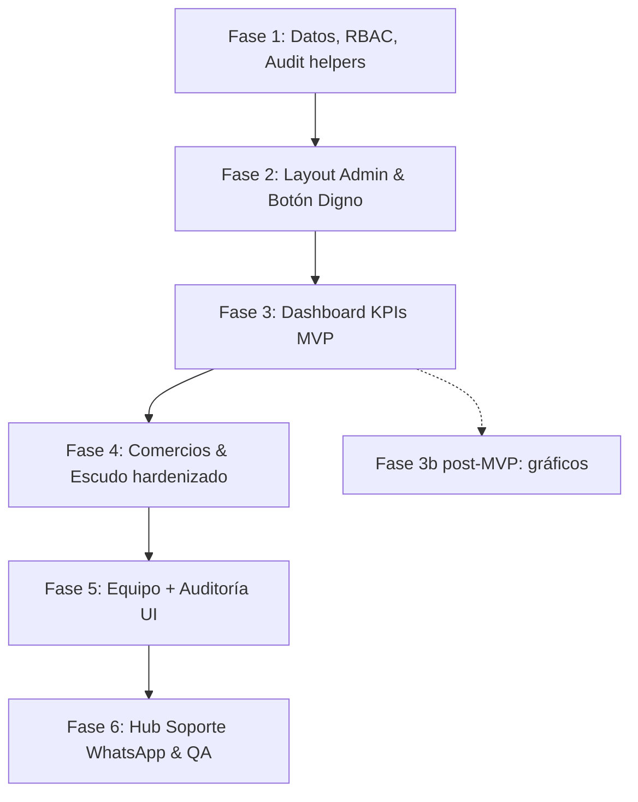

# Especificación Técnica & Funcional: Panel Superadmin, Jerarquía RBAC y Gestión de Red de Comercios

Documento maestro de especificación para la implementación del sistema **Superadmin & Soporte de Plataforma** en **BolivarPide**.

**Estado:** ready for Fase 1 (modelo de datos + RBAC + auditoría).

---

## 1. Visión General y Objetivos

Actualmente, BolivarPide cuenta con un panel básico en `/admin` que valida únicamente `user.app_metadata?.role === "admin"`, enfocado en revisión de leads y números de WhatsApp. Ya existen piezas reutilizables: `src/lib/business/impersonate.ts`, `admin_audit_log`, `is_platform_admin()` y el admin monolítico en `src/app/admin/page.tsx`.

Esta especificación formaliza y eleva la administración de la plataforma para dotar a los fundadores y al equipo de operaciones de:
1. **Jerarquía formal de plataforma (Platform RBAC)** con roles diferenciados: `superadmin` y `soporte`.
2. **Punto de acceso premium y digno** en el sidebar de los comercios (`BusinessSidebar`), visible exclusivamente para usuarios con credenciales de plataforma.
3. **Dashboard central de métricas de red** (MVP: KPIs + Top 5; gráficos avanzados post-MVP).
4. **Buscador & CRUD de Comercios con Modo Escudo (🛡️ Impersonación)**: Capacidad para que el Superadmin asuma la sesión de titular de cualquier local al instante, auditado y con banner flotante de retorno.
5. **Gestión del Equipo de Plataforma**: Reutilización de la estética de `TabEquipo` para administrar superadmins y operadores de soporte.
6. **Hub de Soporte WhatsApp**: Centro de atención rápida con redirecciones asistidas.
7. **Auditoría operativa** (`admin_audit_log` + UI `/admin/auditoria`): trail de acciones privilegiadas, no ruido de pageviews.

---

## 2. Jerarquía de Roles de Plataforma & Políticas de Acceso

### 2.1. Definición de Roles

| Rol | Alcance | Capacidades Clave | Restricciones |
| :--- | :--- | :--- | :--- |
| **`superadmin`** | Cúspide de la jerarquía de BolivarPide | • Acceso total a métricas y finanzas (GMV).<br>• CRUD completo de comercios y planes.<br>• **Modo Escudo (🛡️ Impersonación)**.<br>• Gestión del equipo de plataforma.<br>• Lectura de `admin_audit_log`.<br>• Soporte WhatsApp. | Ninguna dentro de la plataforma. |
| **`soporte`** | Operación y atención al cliente/comercio | • Módulo Soporte (WhatsApp).<br>• Lectura/consulta de comercios (contacto, estado, pedidos recientes).<br>• Lectura de leads (sin aprobar/rechazar en MVP).<br>• KPIs operativos **sin GMV** (locales, pedidos count; no volumen $). | • **NO** Modo Escudo.<br>• **NO** Equipo ni alta/baja de platform staff.<br>• **NO** GMV / ticket promedio / ranking por facturación.<br>• **NO** borrar comercios ni cambiar planes.<br>• **NO** UI de auditoría (solo superadmin). |
| **`owner` / `staff` / `driver`** | Ámbito restringido a comercios | Operan según `business_members`. | Sin acceso a `/admin`. |

### 2.2. Matriz de permisos (fuente de verdad)

| Módulo / Acción | `superadmin` | `soporte` |
| :--- | :---: | :---: |
| Entrar a `/admin/*` | ✅ | ✅ |
| Dashboard KPIs operativos (locales, pedidos count) | ✅ | ✅ |
| Dashboard GMV / ticket / ranking $ | ✅ | ❌ |
| Ver lista de comercios + detalle contacto | ✅ | ✅ |
| Publicar / ocultar comercio | ✅ | ❌ |
| Cambiar plan | ✅ | ❌ |
| Editar datos básicos de comercio | ✅ | ❌ |
| Borrar / desactivar comercio | ✅ | ❌ |
| Modo Escudo (impersonar) | ✅ | ❌ |
| Leads: listar | ✅ | ✅ |
| Leads: aprobar / rechazar | ✅ | ❌ |
| WhatsApp: ver conexiones | ✅ | ✅ |
| WhatsApp: activar / desactivar número | ✅ | ❌ |
| Equipo plataforma (CRUD) | ✅ | ❌ |
| Auditoría (`/admin/auditoria`) | ✅ | ❌ |
| Hub Soporte (wa.me links) | ✅ | ✅ |

Cualquier acción nueva de plataforma se agrega a esta matriz **antes** de implementarse.

### 2.3. Seed del Superadmin inicial (no es regla de producto)

* **Seed de migración / bootstrap:** email `matiasasin123@gmail.com` → `platform_users.role = 'superadmin'` + claims JWT.
* El email **no** se hardcodea en código de aplicación. Opcional: override vía env `PLATFORM_BOOTSTRAP_EMAIL` solo para la migración/seed.
* Tras el seed, altas/bajas de staff viven en `/admin/equipo`.

### 2.4. Contrato JWT (compat hacia atrás)

Mantener el claim legacy para no romper callers existentes (`proxy.ts`, `is_platform_admin()`, `impersonate.ts`, `require-member-api`, WhatsApp admin, etc.):

| Claim | Significado |
| :--- | :--- |
| `app_metadata.role = "admin"` | Es staff de plataforma (cualquier `platform_role`). Gate grueso de `/admin`. |
| `app_metadata.platform_role` | `"superadmin"` \| `"soporte"` — granularidad. |

Ejemplo de claims tras asignación:

```json
{
  "app_metadata": {
    "role": "admin",
    "platform_role": "superadmin"
  }
}
```

**Helpers SQL (complementan, no reemplazan, `is_platform_admin()`):**
* `is_platform_admin()` — existente: `role = 'admin'` (ambos roles de plataforma).
* `is_platform_superadmin()` — `platform_role = 'superadmin'`.
* `is_platform_support()` — `platform_role IN ('soporte', 'superadmin')`.

**Checklist de callers a actualizar en Fase 1–4** (gate grueso → gate fino donde corresponda):
* `src/lib/supabase/proxy.ts` — `/admin` sigue con `role === "admin"`.
* `src/lib/business/impersonate.ts` — exige `platform_role === "superadmin"`.
* `src/lib/business/require-member-api.ts` — admin platform sigue; mutaciones sensibles de MP solo owner/superadmin según deuda P0#6.
* `src/lib/business/whatsappQueries.ts` / actions admin — lectura: support; mutación: superadmin.
* `src/lib/business/actions.ts` (approve/reject/plan/publish) — solo superadmin.
* Guards de layout `/admin/equipo` y `/admin/auditoria` — solo superadmin.
* Queries GMV — solo superadmin (server-side).

**Migración de admins existentes:** todo usuario con `app_metadata.role = 'admin'` sin `platform_role` se trata como `superadmin` en el seed (o se inserta en `platform_users` como tal).

### 2.5. Persistencia, sync de claims y RLS

1. **Tabla `public.platform_users`:**
   ```sql
   CREATE TABLE IF NOT EXISTS public.platform_users (
     user_id uuid PRIMARY KEY REFERENCES auth.users(id) ON DELETE CASCADE,
     role text NOT NULL CHECK (role IN ('superadmin', 'soporte')),
     created_at timestamptz NOT NULL DEFAULT now(),
     updated_at timestamptz NOT NULL DEFAULT now(),
     assigned_by uuid REFERENCES auth.users(id)
   );
   ```
   * **Fuente de verdad** de quién es staff de plataforma.
   * JWT es **cache** para Edge/middleware; RLS privilegiado puede cruzar tabla o claims según helper.

2. **Sincronización de claims — una sola vía:**
   * **Solo Server Actions con service role** (`assignPlatformRole`, `revokePlatformRole`, seed de migración).
   * Flujo: escribir/actualizar/borrar `platform_users` → `supabase.auth.admin.updateUserById` con `app_metadata` → audit log.
   * **No** usar trigger SQL para actualizar Auth (Auth no se sincroniza desde Postgres de forma confiable). Si la Action falla a mitad, compensar o fallar cerrado (no dejar tabla y JWT desfasados sin log).

3. **Revocación:** al remover de `platform_users`, limpiar `platform_role` y `role` de `app_metadata` (quitar staff de plataforma).

4. **Datos sensibles (GMV, `auth.users`):**
   * Agregaciones y búsquedas de usuarios **solo** vía service role / SECURITY DEFINER en Server Actions.
   * No abrir RLS de finanzas ni de `auth.users` a `soporte`.
   * Conteos de `auth.users` para KPI “usuarios registrados”: RPC admin o service client, nunca desde el browser.

---

## 3. Acceso desde el Sidebar ("Botón Digno")

### 3.1. Ubicación y Visibilidad
* **Archivo:** `src/components/business/BusinessSidebar.tsx` (y drawer móvil).
* **Posición:** Sección inferior de utilidades, encima de *"Mis locales"* (o entre Configuración y Mis locales).
* **Condición:** `platform_role IN ('superadmin', 'soporte')` (o `role === 'admin'` como fallback durante migración). Usuario de comercio ordinario: el botón **no** existe en el DOM.

### 3.2. Diseño Visual & Microinteracciones
* **Estilo:** borde sobrio + destello sutil `border border-[#9a0002]/30 bg-gradient-to-r from-[#9a0002]/10 to-[#6b0001]/10 text-[#9a0002] dark:text-[#f87171]`.
* **Ícono:** Material Symbol `admin_panel_settings` o `shield_person`.
* **Texto:** *"Panel Superadmin"* o *"Panel Soporte"* según rol.
* **Badge:** `ROOT` / `SUPER` / `SOPORTE` — `text-[9px] font-black uppercase … bg-[#9a0002] text-white`.
* **Colapsado:** ícono + tooltip *"Panel Superadmin"*.
* **Click →** `/admin`.

---

## 4. Dashboard de Superadmin & Métricas de Red

### 4.1. Layout Base (`/admin/layout.tsx`)
Sidebar retráctil + topbar (perfil, tema, salir). Nav:

1. **Dashboard** (`/admin`)
2. **Comercios** (`/admin/comercios`)
3. **Leads** (`/admin/leads`)
4. **Equipo** (`/admin/equipo`) — solo superadmin (oculto para soporte)
5. **Soporte** (`/admin/soporte`)
6. **Auditoría** (`/admin/auditoria`) — solo superadmin

Protección: `requirePlatformAdmin()` en layout; gates finos por ruta (`requirePlatformSuperadmin()` donde corresponda).

### 4.2. KPIs — MVP (Fase 3)
1. **Locales totales** — desglose: abiertos · publicados · borrador.
2. **Usuarios registrados** — count vía service role sobre `auth.users` (o proxy estable); badge vs mes anterior si es barato.
3. **Pedidos completados** — `delivered`; secundarios: hoy / 7d.
4. **GMV** (`total_cents` de delivered, `$ ARS`) — **solo superadmin**.
5. **Ticket promedio** — GMV / pedidos delivered — **solo superadmin**.
6. **Tasa de éxito** — `delivered / total_orders * 100`.

### 4.3. Visualizaciones
* **MVP:** Top 5 comercios por facturación del mes (superadmin) o por cantidad de pedidos (soporte, sin $).
* **Post-MVP (Fase 3b):** curva 7/30/90 días; donut métodos de pago (MP / efectivo / transferencia).

Todas las queries en `src/lib/admin/queries.ts` (service role). Evitar scans full-table repetidos: preferir SQL agregado / vista materializada si el volumen crece.

---

## 5. Buscador & CRUD de Comercios & Modo Escudo

### 5.1. Vista `/admin/comercios`
* **Buscador:** nombre, slug, email del owner, teléfono.
* **Filtros:** Todos / Publicados / Ocultos / Abiertos ahora; Plan Free / Impulso / Líder.
* **Tabla:** logo, nombre, slug, titular, plan, estado, pedidos, fecha alta.
* **Acciones:**
  * 🛡️ Escudo — solo `superadmin`.
  * 🔗 Tienda pública `/c/[slug]`.
  * ⚙️ Detalles; edición mutante — solo `superadmin`.

### 5.2. Modo Escudo (🛡️) — hardening sobre `impersonate.ts`

**Objetivo:** Superadmin opera el panel del comercio como titular, con trail y salida clara.

**Flujo:**
1. Click escudo → Server Action `startImpersonation(businessId)`.
2. Validar `platform_role === 'superadmin'` (no basta `role === 'admin'`).
3. Cookie httpOnly, `SameSite=Lax`, `path=/`, TTL 1h:
   * Valor **firmado** (HMAC con secret de servidor) o al menos `{ businessId, actorId, exp }` verificado al leer — hoy el UUID plano permite saltarse el audit si alguien forja la cookie siendo admin.
4. Insert `admin_audit_log` (`impersonate_start`, meta: `{ business_id, business_name? }`).
5. Redirect `/negocio/[businessId]/dashboard` (sin depender de `?impersonate=true` como única señal; la cookie firmada es la fuente).
6. `requireBusinessAccess`: si cookie válida **y** actor sigue siendo superadmin → acceso como `owner`. Si perdió el rol o la firma es inválida → ignorar cookie / limpiar.

**Banner (entregable Fase 4; hoy no existe como componente global):**
> 🛡️ **Modo Superadmin Activo:** Estás navegando como titular en **[Nombre]**. `[Salir y Volver al Panel Admin]`

`endImpersonation()` → borrar cookie → `impersonate_end` → `/admin/comercios`.

**Reglas:**
* `soporte` nunca inicia ni hereda impersonación.
* TTL 1h; renovación solo con nuevo `startImpersonation` (re-audit).
* Acciones mutantes hechas bajo Escudo quedan en logs de negocio normales **y** el contexto de impersonación debe poder correlacionarse (ver §9: `meta.impersonating_business_id` en actions críticas si aplica).

---

## 6. Gestión de Equipo (`/admin/equipo`)

### 6.1. UI (inspirada en `TabEquipo`)
Grid de tarjetas: `coverGradient`, `UserAvatarView`, nombre, email, badge de rol (`Superadmin` / `Soporte`).

### 6.2. Acciones (solo superadmin)
1. **Asignar:** modal busca por **email exacto** (y opcionalmente nombre en `user_profiles`).
   * `auth.users` **no** es queryable desde el client.
   * Server Action `searchUserForPlatformInvite(email)` con service role → si existe, ofrece roles; si no, mensaje “el usuario debe haber iniciado sesión al menos una vez”.
2. Persistencia: `platform_users` + sync JWT (§2.5) + audit.
3. **Editar rol** / **revocar**. Bloqueo: no auto-degradarse ni revocarse si se es el **último** superadmin.
4. Ruta y nav ocultas para `soporte` (403 server-side, no solo UI).

---

## 7. Módulo de Soporte WhatsApp (`/admin/soporte`)

### 7.1. MVP
1. CTA a WhatsApp oficial de BolivarPide (plantillas).
2. Directorio de comercios → `wa.me` al titular con mensaje prearmado.
3. (Opcional liviano) pedidos cancelados/demorados del día → link al cliente **si** hay teléfono; si no hay dato, no inventar UI vacía.

### 7.2. Post-MVP
Bandeja multicanal / chat in-app. La ruta `/admin/soporte` se reserva; no sobre-diseñar ahora.

Cada apertura asistida de contacto puede loguearse como evento liviano (§9) si aporta trazabilidad operativa; no es obligatorio en v1 del hub.

---

## 8. Auditoría UI (`/admin/auditoria`)

* Solo `superadmin`.
* Lista paginada de `admin_audit_log`: filtros por `action`, `actor`, rango de fechas, `target_type` / `target_id`.
* Columnas: fecha, actor (email), action, target, meta resumida.
* Hoy la tabla es **service_role-only** en RLS: la página lee vía service client tras `requirePlatformSuperadmin()`. No abrir SELECT a `authenticated` genérico.
* No es un SIEM: es el trail de acciones de plataforma para “quién tocó qué”.

---

## 9. Logs & Auditoría — qué registrar (y qué no)

Objetivo: **accountability de privilegio**, no analytics de producto. Un superadmin que cambia un plan o entra a un local debe quedar en disco; un scroll por el dashboard no.

### 9.1. Canal canónico: `admin_audit_log`

Schema existente:

```sql
-- actor_user_id, action, target_type, target_id, meta jsonb, created_at
```

**Convención `action` (snake_case, estable):**

| `action` | Cuándo | `target_type` / `target_id` | `meta` sugerido |
| :--- | :--- | :--- | :--- |
| `impersonate_start` | Inicio Modo Escudo | `business` / businessId | `{ business_name }` |
| `impersonate_end` | Salida Escudo | `business` / businessId | `{ duration_s? }` |
| `approve_lead` | Lead aprobado | `lead` / leadId | `{ business_id, plan? }` |
| `reject_lead` | Lead rechazado | `lead` / leadId | `{ reason? }` |
| `set_published` | Publicar/ocultar | `business` / id | `{ published: bool }` |
| `set_plan` | Cambio de plan | `business` / id | `{ from, to }` |
| `platform_role_assign` | Alta en equipo | `user` / userId | `{ role, email }` |
| `platform_role_change` | Cambio de rol | `user` / userId | `{ from, to }` |
| `platform_role_revoke` | Baja de equipo | `user` / userId | `{ previous_role, email }` |
| `whatsapp_set_active` | Toggle conexión WA | `business` / id | `{ phone_e164?, active }` |
| `business_update_admin` | Edit admin de comercio | `business` / id | `{ fields: [...] }` — sin PII innecesaria |
| `audit_export` *(post-MVP)* | Export CSV del log | `audit` / — | `{ row_count, filters }` |

Ya hay varios de estos en `actions.ts` / `impersonate.ts`; Fase 1–5 debe **completar** los de equipo y endurecer Escudo, no inventar un segundo sistema de logs.

### 9.2. Qué SÍ loguear (privilegio)

* Toda **mutación** hecha desde `/admin` o Server Actions de plataforma.
* **Inicio y fin** de impersonación (obligatorio).
* Cambios de **membresía de plataforma** (quién nombró a quién).
* Cambios de **plan / published / lead**.
* Fallos de autorización relevantes (opcional en `meta` o logger estructurado): intento de Escudo por `soporte`, acceso denegado a `/admin/equipo`.

### 9.3. Qué NO loguear

* Pageviews, clicks de navegación, hover, filtros de búsqueda del listado.
* Payloads completos de formularios, tokens, cookies, service keys.
* Contenido de mensajes WhatsApp / cuerpos de chat.
* PII de más: preferir IDs; email del **actor** y del **target** en `meta` solo cuando aporta (equipo); no volcar direcciones ni teléfonos de clientes en el audit salvo necesidad operativa explícita.
* Cada lectura de KPI / GMV en el dashboard (ruido). Si más adelante se quiere compliance de “quién vio finanzas”, un evento muestreado `metrics_view` basta — no en MVP.

### 9.4. Logger de aplicación (complemento, no reemplazo)

Además del audit append-only en DB:

* **Server:** logs estructurados (JSON) en acciones admin — `level`, `action`, `actor_id`, `request_id`, resultado `ok|error`. Útil en Render/hosting para incidentes.
* **Cliente:** no loguear privilegios al browser console en producción.
* Correlación: mismo `action` string en audit DB y en log de app cuando falle una Action a mitad (ej. escribió `platform_users` pero falló `updateUserById`).

### 9.5. Retención e integridad

* `admin_audit_log`: append-only desde app (sin UPDATE/DELETE desde UI). Borrado solo por política de retención operativa (post-MVP; p.ej. 12–24 meses).
* Lectura: solo superadmin vía service role (§8).
* `meta` versionable: no romper readers si se agregan keys.

---

## 10. MVP vs post-MVP (YAGNI)

| Incluido en MVP (Fases 1–6) | Diferido |
| :--- | :--- |
| RBAC + seed + JWT contract | — |
| Layout admin + botón digno | — |
| KPIs + Top 5 | Gráficos 7/30/90, donut pagos |
| Comercios + Escudo hardenizado + banner | — |
| Equipo (assign/change/revoke) | Invites por email a users que aún no existen |
| Soporte wa.me comercios (+ oficial) | Bandeja multicanal; directorio incidencias clientes si no hay datos |
| UI auditoría básica | Export CSV, alertas, retención automática |
| Audit actions de la tabla §9.1 | `metrics_view`, `audit_export` |

---

## 11. Plan de Implementación por Fases



### Fase 1: Modelo de Datos, Roles & RBAC
* Migración `platform_users` + `is_platform_superadmin()` / `is_platform_support()`.
* Seed bootstrap (email de §2.3 / env) → superadmin + claims.
* Admins legacy → `platform_users` como superadmin.
* Helpers TS: `requirePlatformAdmin()`, `requirePlatformSuperadmin()`, `getPlatformRole()`.
* Proxy: sigue gate `role === 'admin'`; documentar checklist §2.4.
* Helper de escritura audit reutilizable si aún no está centralizado.

### Fase 2: Layout & Botón Digno
* `BusinessSidebar` + drawer: entrada condicional.
* `AdminLayout` con nav según matriz (§2.2); `requirePlatformAdmin()` en layout.

### Fase 3: Dashboard KPIs MVP
* `src/lib/admin/queries.ts` — agregados; GMV solo superadmin.
* Grid KPIs + Top 5. Sin gráficos temporales todavía.

### Fase 4: Comercios & Modo Escudo
* `/admin/comercios` con filtros; mutaciones solo superadmin.
* Hardening cookie firmada + gate `platform_role`; `ImpersonationBanner`; audit start/end.

### Fase 5: Equipo + Auditoría UI
* `/admin/equipo` + search por email (service role) + assign/change/revoke + audit actions nuevas.
* `/admin/auditoria` paginada (solo superadmin).
* Último-superadmin protection.

### Fase 6: Hub Soporte & QA
* `/admin/soporte` MVP (oficial + directorio comercios).
* QA:
  * Login bootstrap → permisos superadmin.
  * Botón digno en sidebar comercio.
  * Escudo: entrar, banner, mutar algo, salir, ver `impersonate_*` en auditoría.
  * Usuario `soporte`: ve comercios/soporte/KPIs sin $; 403 en equipo, auditoría, Escudo, approve lead, set plan.

---

## 12. Criterio de “listo para codear”

Fase 1 puede empezar cuando este doc se tome como contrato. No bloquea: emails de plantillas WhatsApp, copy exacto del banner, ni la Fase 3b de gráficos.
